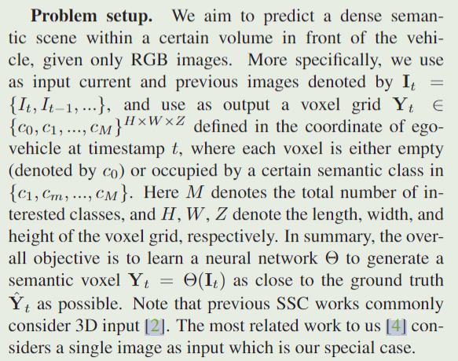

# 道来Occ   
### Q：有什么优点？   
1. 对障碍物的几何形状或语义类别不敏感，对遮挡的抵抗力更强；   
2. 理想的多模态传感器融合，作为不同传感器对齐的统一空间坐标；   
3. 鲁棒不确定性估计，因为每个单元存储不同障碍物存在的联合概率。   
4. 对复杂场景以及长尾问题更鲁棒   
   
### Q：Semantic Scene Completion 与 occupancy 联系与区别？   
语义场景补全（Semantic scene completion-SSC）利用有限的观测推理出整个场景的几何和语义信息。有多种不同特征描述子：基于Voxel的，基于TPV的。   
基于Voxel的特征描述，用数学描述如下：   
    
**区别**：SSC提供更多的语义信息，而Occ只提供是否占用等二值简单分类语义信息更简单。   
**联系**：常常将SSC的细粒度点云标注通过体素化或者说栅格化得到Occ的GT。Tesla 的Occupancy network可以看作自动驾驶中3D SSC的一个实现。人可以自然的从部分观测中推理出整个场景的几何和语义信息，而SSC同时也涉及两个任务：可观测区域的场景重建和不可观测区域的补全。   
### Q：基于camera的Occ方法可以分为几类，分别举例介绍？   
2种：Explicit Voxel-based Networks和 Implicit Neural Rendering   
**Explicit Voxel-based Networks，如MonoScene, VoxFormer, 和 OccDepth等**   
   
### **Q：Explicit Voxel-based Networks 有哪些代表作？**   
1. [TPVFormer](tpvformer.md)   
2. [VoxFormer](voxformer.md)   
3. [MonoScene](monoscene.md)   
